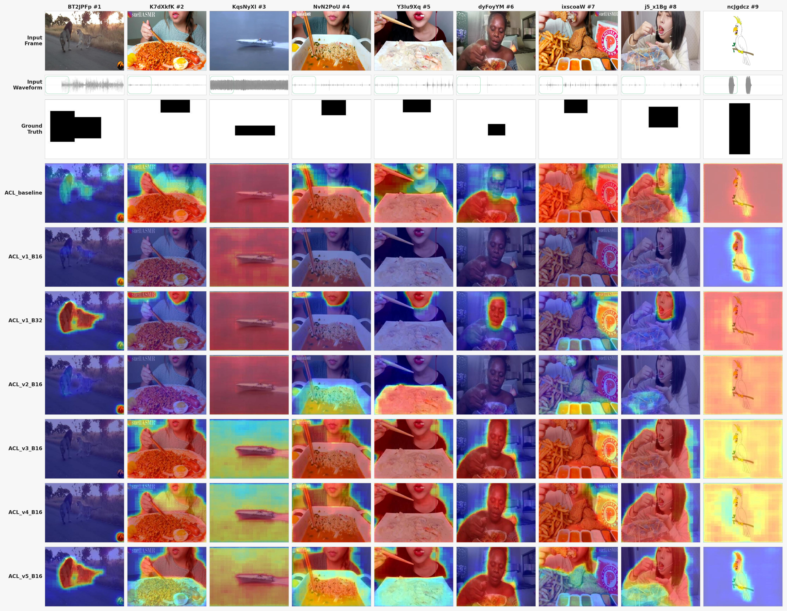
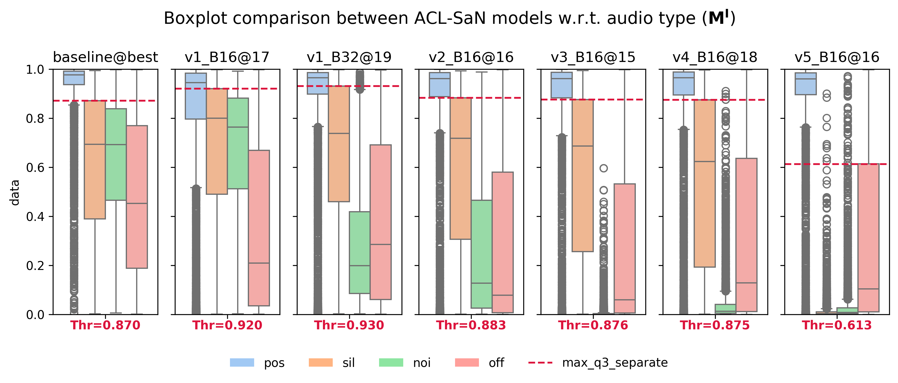
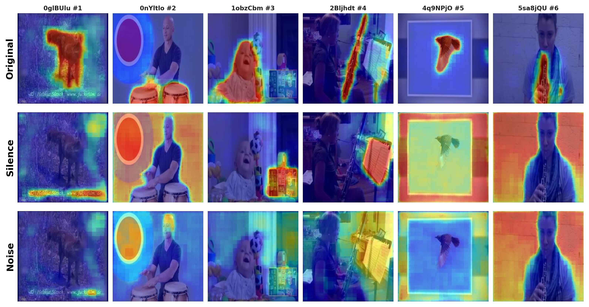
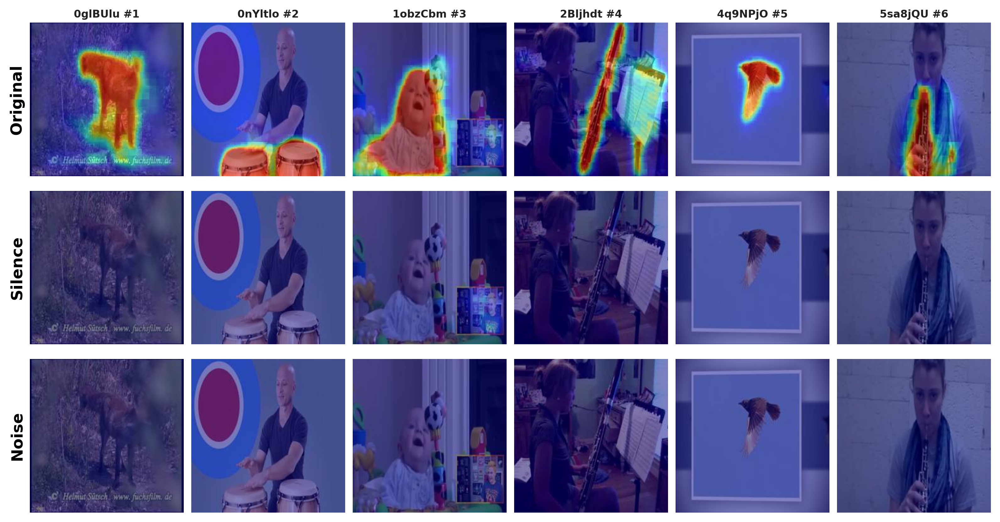

# Towards Robust Visual Sound Source Localization

> **Assessing and Enhancing the ACL-SSL Framework with Negative Audio Samples**
>
> Undergraduate Thesis — *Luca Franceschi*, *Universitat Pompeu Fabra*, *2026*
>
> Forked from [ACL-SSL](https://github.com/swimmiing/ACL-SSL) (Park et al., WACV 2024)

---

## Overview

**Visual Sound Source Localization (VSSL)** identifies spatial regions in images or videos that correspond to sound sources in the accompanying audio stream. While existing methods achieve strong benchmark results, they struggle with *negative audio samples* — silence, noise, and offscreen sounds — due to a lack of mechanisms that suppress false positive activations.

This thesis addresses these limitations in the ACL-SSL framework through two contributions:

1. **ACL-SaN** — a Silence-and-Noise aware training objective that explicitly penalizes false positive activations on negative audio inputs.
2. **Grounder ablation** — an ablation study on ACL-SSL's CLIPSeg-based Audio-Visual Grounder, assessing the feasibility of a fully self-supervised alternative.

## Environment

All the dependencies are listed in the [environment.yaml](environment.yaml) file. The environment can be built with the Singularity [container definition file](container.def) or through any other means.

## Datasets

| Dataset | Usage | Link |
|---|---|---|
| VGG-Sound | Training | [Link](https://www.robots.ox.ac.uk/~vgg/data/vggsound/) |
| AVATAR | Evaluation | [Link](https://hahyeon610.github.io/Video-centric_Audio_Visual_Localization/) |
| AVSBench | Evaluation | [Link](https://github.com/OpenNLPLab/AVSBench) |
| VGG-SS | Evaluation | [Link](https://www.robots.ox.ac.uk/~vgg/research/lvs/) |
| Flickr-SoundNet | Evaluation | [Link](https://github.com/ardasnck/learning_to_localize_sound_source) |
| Extended VGG-SS / Flickr | Evaluation | [Link](https://github.com/stoneMo/SLAVC) |

Inside each dataset directory there are scripts to help extract the datasets into its place that may be helpful.

## Training and Evaluation

Multiple training and evaluation scripts can be found in the [scripts](scripts/) directory.

## Results

### Comparison between baseline and best trained model

**ACL-SSL**

**ACL-SaN (v5)**
